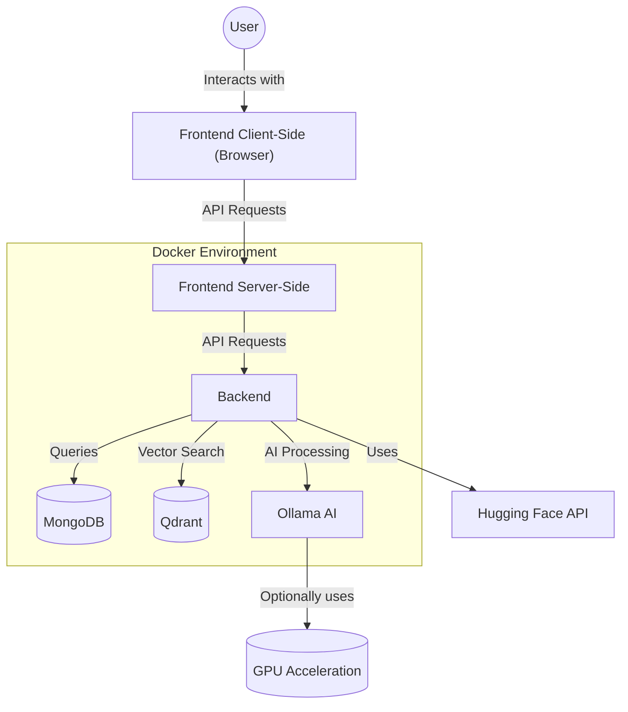

# Welcome to Chatty the Lab

This documentation will guide you through the process of setting up and using our AI model comparison platform.

Chatty the Lab is an experimental playground that lets you:

- Compare multiple AI models side-by-side from different providers (Ollama, Hugging Face, OpenAI, etc.)
- Configure custom context windows and model parameters
- Analyze differences in model behavior through parallel outputs

## Application Architecture

## Quick start 
Follow these steps to get Chatty the Lab up and running in minutes: [Installation Guide](installation.md)

