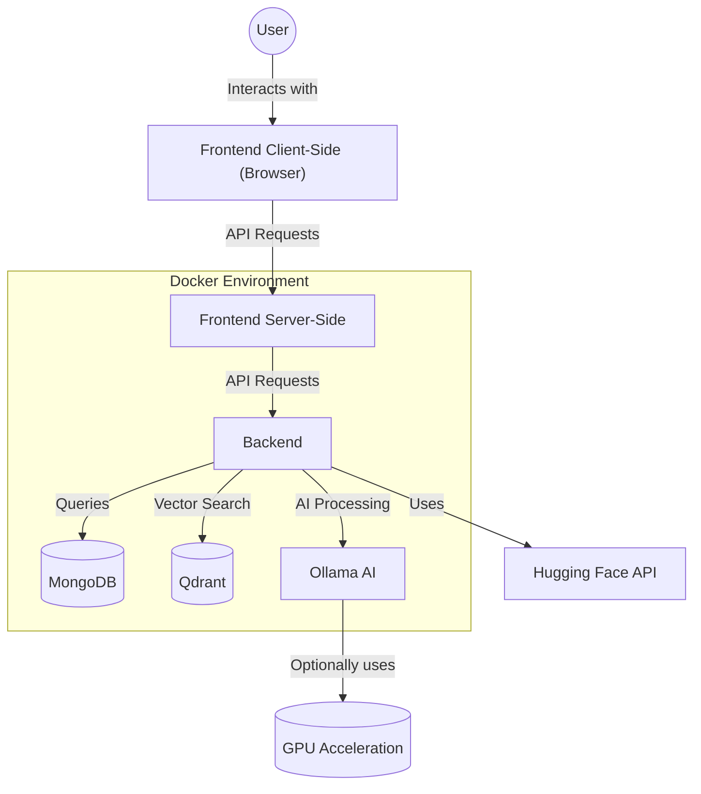
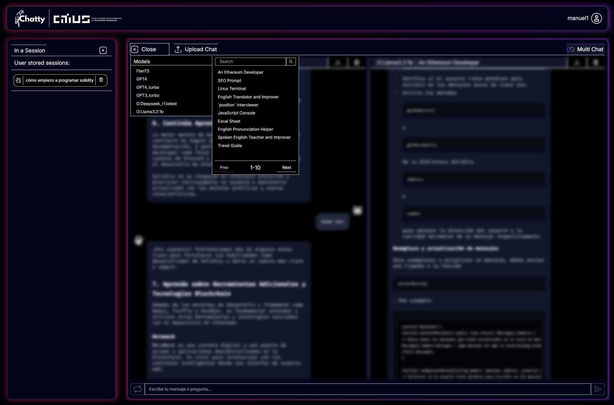

# Chatty the Lab 🧪⚡

**Experiment with AI models side-by-side**  
*Compare outputs, tweak parameters, and discover model behaviors in real-time*



[](https://www.docker.com)
[](LICENSE)
[](https://openai.com)

  
*Settings panel screenshot*

1. **Choose Models** - Local (Ollama) vs Cloud (OpenAI) vs Open Source (HF)
2. **Set Parameters** - Temperature, Max Tokens, Context Window
3. **Prompt** - Type or paste your text
4. **Compare** - Side-by-side outputs with token counters

## 🚀 Key Features

- 🔄 **Multi-provider support** - Ollama, OpenAI, Hugging Face, Anthropic
- ⚡ **Real-time comparisons** - View 2-4 model outputs simultaneously
- 🧠 **Context playground** - Adjust window size, temperature, max tokens
- 📦 **One-click deploy** - Fully Dockerized stack (MongoDB + Qdrant included)
- 📊 **Export results** - CSV/JSON formats for analysis


## ⚡ Quick Start

```yaml
version: '3.8'

services:
  ollama:
    image: manuc1k/demo-inside-the-lab-ollama:latest
    # deploy:
    #   resources:
    #     reservations:
    #       devices:
    #         - driver: nvidia
    #           count: all
    #           capabilities: [gpu]
    healthcheck:
      test: ["CMD", "curl", "-f", "http://localhost:11434/"]
      interval: 30s
      timeout: 20s
      retries: 5
      start_period: 60s

  database:
    image: manuc1k/demo-inside-the-lab-database:latest
    healthcheck:
      test: echo 'db.runCommand("ping").ok' | mongosh localhost:27017/test --quiet
      interval: 20s
      timeout: 10s
      retries: 5
      start_period: 60s

  qdrant:
    image: manuc1k/demo-inside-the-lab-qdrant:latest
    healthcheck:
      test: ["CMD", "curl", "-f", "http://localhost:6333/healthz"]
      interval: 30s
      timeout: 10s
      retries: 10
      start_period: 60s

  backend:
    image: manuc1k/demo-inside-the-lab-backend:latest
    environment:
    depends_on:
      database:
        condition: service_healthy
      qdrant:
        condition: service_healthy
      ollama:
        condition: service_healthy

  frontend:
    image: manuc1k/demo-inside-the-lab-frontend:latest
    ports:
      - "3000:3000"
    depends_on:
      - backend
```

# 2. Start the stack (requires Docker)
```bash
docker compose up -d
```

# 3. Access at http://localhost:3000

> 💡 **Pro Tip:** Add your OpenAI key in `docker-compose.yml` for GPT-4 comparisons!

## 🛠️ Configuration

### Model Selection
```yaml
- OPENAI_KEY=your_openai_key
- MISTRAL_KEY=your_mistral_key
- GEMINI_KEY=your_gemini_key
```


## 🚨 Need Help?

- 📚 [Full Documentation](https://your-docs.site)  
- 🐛 [Report Issues](https://github.com/your/repo/issues)  
- 💬 [Join Discord](https://discord.gg/your-invite)  

## 📜 License

MIT License - See [LICENSE](LICENSE).  
*Cloud model access requires separate API keys and compliance with provider terms.*

---

**Happy Experimenting!** 🧑🔬✨  
*Contribute models or report bugs → [GitHub Repo](https://github.com/your/repo)*  
[☕ Buy Me a Coffee](https://buymeacoffee.com/your-profile)
```

Este diseño incluye:
1. Badges visuales para estado clave
2. Secciones claras con emojis relevantes
3. Bloques de código listos para copiar
4. Llamados a la acción visuales
5. Espacio para screenshots reales
6. Formato mobile-friendly
7. Enlaces de soporte destacados

Para completar:
1. Reemplazar URLs de placeholder con imágenes reales
2. Actualizar enlaces de documentación/soporte
3. Añadir captura real de la interfaz
4. Personalizar mensaje final

¿Necesitas ayuda para generar algún asset visual específico o ajustar el tono?